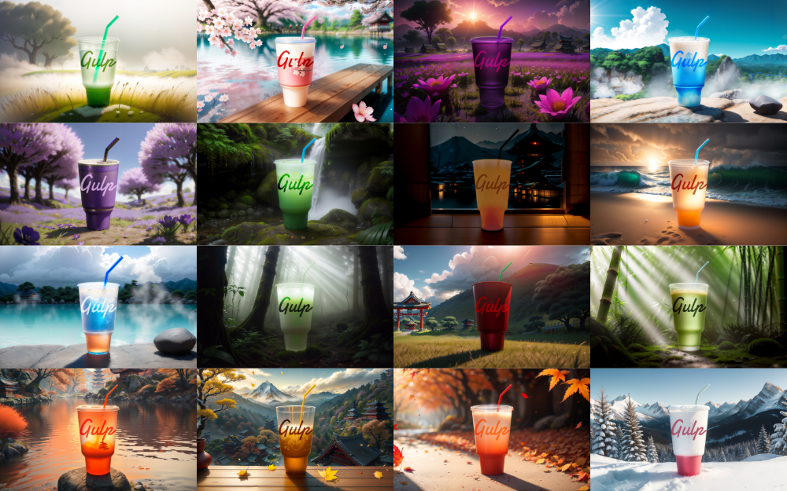

# Introduction to Gulp.js



## Tutorial

These are the files for my series *Introduction to Gulp.js* published on my website [stefanimhoff.de](http://stefanimhoff.de/).

## Tutorial Overview

1. [Intro and Setup](http://stefanimhoff.de/2014/gulp-tutorial-1-intro-setup)
2. [Server with BrowserSync and Configuration](http://stefanimhoff.de/2014/gulp-tutorial-2-development-server-browsersync-configuration/)
3. [Build, Clean and Jekyll](http://stefanimhoff.de/2014/gulp-tutorial-3-build-clean-jekyll/)
4. [Creating CSS with Sass (and Compass)](http://stefanimhoff.de/2014/gulp-tutorial-4-css-generation-sass/)
5. [Bundling JavaScript with Browserify](http://stefanimhoff.de/2014/gulp-tutorial-5-javascripts-browserify/)
6. [Images and Vector Fonts](http://stefanimhoff.de/2014/gulp-tutorial-6-images-vector-fonts/)
7. [Base64 Encoded Images](http://stefanimhoff.de/2014/gulp-tutorial-7-base64/)
8. [Watch for Changes](http://stefanimhoff.de/2014/gulp-tutorial-8-watch/)
9. [Checking the Syntax of SCSS and JavaScript](http://stefanimhoff.de/2014/gulp-tutorial-9-linting-scss-and-javascript/)
10. [Generating CSS Image Sprites](http://stefanimhoff.de/2014/gulp-tutorial-10-generating-sprites/)
11. [Production Build, Server and Jekyll](http://stefanimhoff.de/2014/gulp-tutorial-11-production-build-server-and-jekyll/)
12. [Optimize CSS, JavaScript, Images and HTML](http://stefanimhoff.de/2014/gulp-tutorial-12-optimize-css-javascript-images-and-html/)
13. [Revisioning](http://stefanimhoff.de/2014/gulp-tutorial-13-revisioning/)
14. [Deploying the Website with Rsync](http://stefanimhoff.de/2014/gulp-tutorial-14-deploying-the-website/)
15. [Performance Improvements with WebP and Gzip](http://stefanimhoff.de/2014/gulp-tutorial-15-performance-improvements-webp-gzip/)
16. [PostCSS](http://stefanimhoff.de/2015/gulp-tutorial-16-postcss/)

## Preparation

Install `nvm` and `node`:

```sh
$ git clone https://github.com/creationix/nvm.git ~/.nvm
$ cd ~/.nvm
$ git checkout `git describe --abbrev=0 --tags`
```

```sh
$ export NVM_DIR="$HOME/.nvm/"
$ [ -s "$NVM_DIR/nvm.sh" ] && . "$NVM_DIR/nvm.sh"  # This loads nvm
```

```sh
nvm install 6.3.1
```

If you like install `yarn`, I provide a `yarn.lock` file:

```sh
brew install yarn
```

Install `bundler`:

```sh
$ gem install bundler
```

Install `bower`:

```sh
$ npm install -g bower
```

## Installation

Clone the repository on your computer and change into the projects folder. Run:

```sh
$ bundle
$ bower install
$ npm install
```

To install  [Fontcustom](http://fontcustom.com/) you should have [Homebrew](http://brew.sh/) installed or use another package management tool to install the dependencies:

```sh
$ brew install fontforge --with-python
$ brew install eot-utils
```

## Setup

Open `gulp/config.js` and change settings if needed. Only the `rsync` settings need to be adjusted. Change the `destination` to a path on your webserver and change `hostname` and `username`.

## Running Gulp.js

Three tasks are available (`npm` works, too):

```sh
$ yarn start
$ yarn run publish
$ yarn run deploy
```

- Running `yarn start` will start a development server, build assets and the Jekyll site and start a `watch` task.
- Running `yarn run publish` will copy and optimize assets and run a production build of Jekyll.
- Running `yarn run deploy` will copy the generated files with Rsync to your server.

## Sass, Compass or PostCSS

The current version of this tutorial uses PostCSS. If you would like to use Sass (or Compass), you can still easily access the old code in the branch `ruby-sass`. The new code at the time I wrote the article is available in the branch `postcss`. Additionally I merge it into master and will process with PostCSS in my tutorial.

## Credits

This tutorial includes some files for demonstation purposes:

- The [Gulp.js logo](http://gulpjs.com/) used as image example
- The pattern [Light gray](http://subtlepatterns.com/light-fray/) by [Brenda Lay](http://poisones.tumblr.com/), published on [Subtle Patterns](http://subtlepatterns.com/)
- The SVGs and PNGs are take from the [IcoMoon Icon Pack](https://icomoon.io/#icons-icomoon).
